# E-Commerce Platform Example

This example demonstrates the complete Master Agent system with a real-world e-commerce platform scenario.

## Project Overview

**Project:** Modern E-Commerce Platform
**Architecture:** Monorepo (Turborepo)
**PM Tool:** Jira
**CI/CD:** GitHub Actions
**Security:** SOC2 Type II compliance required

### Workspaces

```
ecommerce-platform/
├── apps/
│   ├── web/                 # Next.js storefront
│   ├── admin/               # Admin dashboard
│   └── mobile/              # React Native app
├── packages/
│   ├── ui/                  # Shared UI components
│   ├── api-client/          # API client library
│   ├── auth/                # Authentication package
│   └── config/              # Shared configuration
├── services/
│   ├── api/                 # Main API service
│   ├── payment/             # Payment processing
│   └── inventory/           # Inventory management
└── infrastructure/
    ├── terraform/           # Infrastructure as Code
    └── k8s/                 # Kubernetes manifests
```

## Master Agent Integration

### Phase 1: Project Initialization

```bash
# Initialize Master Agent
cd ecommerce-platform
python -m master_agent.integrations.integration_manager

# Select Jira + GitHub Actions
# Generated files:
# - .master-agent/jira_config.json
# - .master-agent/jira_workflow.md
# - .github/workflows/master-agent.yml
# - scripts/deploy.sh
```

### Phase 2: PRD Processing

**Input:** Product Requirements Document (PRD)

```markdown
# Feature: User Authentication & Authorization

## Overview
Implement secure user authentication with role-based access control (RBAC)
for customers, sellers, and administrators.

## Requirements

### R1: User Registration
- Email/password registration
- OAuth integration (Google, Facebook)
- Email verification
- Password strength requirements (SOC2 CC6.1)

### R2: Authentication
- JWT-based authentication
- Refresh token mechanism
- Session management
- Multi-device support

### R3: Authorization (RBAC)
- Customer role (browse, purchase)
- Seller role (manage products, view orders)
- Admin role (full access)
- Fine-grained permissions

### R4: Security Requirements (SOC2)
- Encrypted password storage (bcrypt)
- Secure token transmission (HTTPS only)
- Account lockout after failed attempts
- Audit logging for authentication events
```

**Master Agent Processing:**

```python
from master_agent.agents import (
    RequirementsAnalyst,
    Architect,
    FrontendArchitect,
    BackendArchitect,
    SecurityLead
)
from master_agent.integrations import JiraIntegration

# Parse PRD
analyst = RequirementsAnalyst()
requirements = analyst.parse_prd(prd_path="auth_prd.md")

# Generate architecture
architect = Architect()
architecture = architect.design_system(requirements)

# Create Jira issues
jira = JiraIntegration.from_config()

# Create epic
epic = jira.create_issue(
    issue_type="Epic",
    summary="Feature: User Authentication & Authorization",
    description=requirements.overview,
    labels=["authentication", "security", "soc2"]
)

# Create user stories
stories = []
for req in requirements.user_requirements:
    story = jira.create_issue(
        issue_type="Story",
        summary=req.title,
        description=req.description,
        parent=epic.key,
        labels=req.tags,
        components=["Authentication"]
    )
    stories.append(story)

    # Create technical tasks
    frontend = FrontendArchitect()
    backend = BackendArchitect()

    # Frontend tasks
    for task in frontend.generate_tasks(req):
        jira.create_issue(
            issue_type="Task",
            summary=task.title,
            description=task.description,
            parent=story.key,
            labels=["frontend"],
            components=["Web", "Mobile"]
        )

    # Backend tasks
    for task in backend.generate_tasks(req):
        jira.create_issue(
            issue_type="Task",
            summary=task.title,
            description=task.description,
            parent=story.key,
            labels=["backend"],
            components=["API"]
        )

# Security validation
security_lead = SecurityLead()
security_tasks = security_lead.validate_requirements(requirements)

for task in security_tasks:
    jira.create_issue(
        issue_type="Task",
        summary=task.title,
        description=task.description,
        parent=epic.key,
        labels=["security", "soc2"],
        priority="High"
    )
```

**Generated Jira Structure:**

```
Epic: ECOM-100 - User Authentication & Authorization
├── Story: ECOM-101 - User Registration
│   ├── Task: ECOM-102 - Create registration form (Frontend)
│   ├── Task: ECOM-103 - Implement registration API (Backend)
│   ├── Task: ECOM-104 - Email verification service (Backend)
│   └── Task: ECOM-105 - Password strength validation (Frontend)
├── Story: ECOM-106 - JWT Authentication
│   ├── Task: ECOM-107 - JWT generation service (Backend)
│   ├── Task: ECOM-108 - Token refresh mechanism (Backend)
│   ├── Task: ECOM-109 - Auth middleware (Backend)
│   └── Task: ECOM-110 - Login form with token storage (Frontend)
├── Story: ECOM-111 - RBAC Authorization
│   ├── Task: ECOM-112 - Role model implementation (Backend)
│   ├── Task: ECOM-113 - Permission middleware (Backend)
│   └── Task: ECOM-114 - Role-based UI rendering (Frontend)
└── Story: ECOM-115 - Security Compliance
    ├── Task: ECOM-116 - Implement bcrypt password hashing
    ├── Task: ECOM-117 - HTTPS enforcement
    ├── Task: ECOM-118 - Account lockout mechanism
    └── Task: ECOM-119 - Authentication audit logging
```

### Phase 3: Development Workflow

**Developer starts work on ECOM-102:**

```bash
# Create branch
git checkout -b ECOM-102-registration-form

# Master Agent auto-updates Jira
# Status: To Do → In Progress
```

**Developer implements registration form:**

```typescript
// apps/web/components/auth/RegistrationForm.tsx

import { useState } from 'react';
import { useAuth } from '@ecommerce/auth';
import { Button, Input, PasswordStrengthIndicator } from '@ecommerce/ui';

export function RegistrationForm() {
  const [email, setEmail] = useState('');
  const [password, setPassword] = useState('');
  const { register } = useAuth();

  const handleSubmit = async (e: React.FormEvent) => {
    e.preventDefault();
    await register({ email, password });
  };

  return (
    <form onSubmit={handleSubmit}>
      <Input
        type="email"
        value={email}
        onChange={(e) => setEmail(e.target.value)}
        placeholder="Email"
        required
      />
      <Input
        type="password"
        value={password}
        onChange={(e) => setPassword(e.target.value)}
        placeholder="Password"
        required
      />
      <PasswordStrengthIndicator password={password} />
      <Button type="submit">Register</Button>
    </form>
  );
}
```

**Commit and push:**

```bash
git add .
git commit -m "ECOM-102: Implement registration form with password strength indicator"
git push origin ECOM-102-registration-form
```

**Master Agent CI/CD Pipeline Triggers:**

```yaml
# .github/workflows/master-agent.yml automatically runs:

name: Master Agent CI/CD

on:
  push:
    branches: [ECOM-*]
  pull_request:
    branches: [main]

jobs:
  # 1. Monorepo Analysis
  analyze-changes:
    runs-on: ubuntu-latest
    steps:
      - uses: actions/checkout@v4
      - name: Detect affected workspaces
        id: affected
        run: |
          python -m master_agent.orchestration.monorepo_coordinator \
            --detect-affected \
            --base-ref origin/main
      - name: Output affected workspaces
        run: echo "Affected: ${{ steps.affected.outputs.workspaces }}"
        # Output: "web, ui, auth"

  # 2. Quality Gates (only affected workspaces)
  quality:
    needs: analyze-changes
    runs-on: ubuntu-latest
    strategy:
      matrix:
        workspace: ${{ fromJson(needs.analyze-changes.outputs.workspaces) }}
    steps:
      - name: Lint workspace
        run: |
          cd ${{ matrix.workspace }}
          npm run lint
      - name: Type check
        run: |
          cd ${{ matrix.workspace }}
          npm run type-check

  # 3. Security Scan
  security:
    runs-on: ubuntu-latest
    steps:
      - name: Secret Scanner
        run: |
          python -m master_agent.agents.security.secret_scanner \
            --workspace apps/web
      - name: SOC2 Compliance Check
        run: |
          python -m master_agent.agents.security.compliance_validator \
            --control CC6.1 \
            --workspace apps/web

  # 4. Build affected workspaces
  build:
    needs: [quality, security]
    runs-on: ubuntu-latest
    steps:
      - name: Build with Turborepo
        run: |
          npx turbo run build \
            --filter=...[${{ github.base_ref }}] \
            --cache-dir=.turbo

  # 5. Update Jira
  update-jira:
    needs: build
    runs-on: ubuntu-latest
    steps:
      - name: Add commit to Jira
        run: |
          python -m master_agent.integrations.jira_integration \
            --add-comment ECOM-102 \
            --message "Build passed: ${{ github.sha }}"
```

**Create Pull Request:**

```bash
gh pr create \
  --title "ECOM-102: Implement registration form" \
  --body "Implements user registration form with:
- Email input validation
- Password strength indicator (SOC2 CC6.1)
- Form submission handling
- Error display

Closes ECOM-102"
```

**Master Agent auto-transitions Jira:**
- Status: In Progress → In Review
- Comment: "PR created: #123"

### Phase 4: Security Validation

**Security Lead reviews PR:**

```python
from master_agent.agents.security import AuditorEnhanced, ComplianceValidator

# Run security audit
auditor = AuditorEnhanced(project_root="apps/web")
audit_results = auditor.audit_all()

# Check SOC2 compliance
validator = ComplianceValidator(project_root="apps/web")
compliance = validator.validate_cc61_access_control()

if not compliance.passed:
    print("❌ SOC2 CC6.1 violations:")
    for violation in compliance.violations:
        print(f"  - {violation.description}")
        print(f"    File: {violation.file_path}:{violation.line_number}")
        print(f"    Recommendation: {violation.recommendation}")
```

**Automated Security Report:**

```
🔒 Security Audit Report - ECOM-102
================================================================================

✅ Secret Scanner: PASSED
   - No exposed secrets detected
   - Scanned 12 files

✅ SOC2 CC6.1 (Access Control): PASSED
   - Password hashing: bcrypt ✓
   - Password strength validation: implemented ✓
   - Authentication required: verified ✓

⚠️  OWASP Top 10: 1 WARNING
   - apps/web/components/auth/RegistrationForm.tsx:45
     Issue: Missing CSRF protection
     Severity: Medium
     Recommendation: Add CSRF token to form submission

📊 Summary:
   - Total checks: 25
   - Passed: 24
   - Failed: 0
   - Warnings: 1
```

**Security Lead comments on PR:**

```markdown
## Security Review

✅ **Approved with minor recommendation**

### SOC2 Compliance
- ✅ CC6.1: Access control implemented correctly
- ✅ Password hashing with bcrypt
- ✅ Password strength requirements enforced

### Recommendations
1. Add CSRF protection to form (non-blocking)
2. Consider adding rate limiting for registration endpoint

### Next Steps
- Address CSRF warning in follow-up task
- Proceed with merge
```

### Phase 5: PR Merge & Deployment

**PR merged to main:**

```bash
# Master Agent automatically:
# 1. Transitions Jira ECOM-102: In Review → Done
# 2. Adds merge comment to Jira
# 3. Triggers deployment pipeline
```

**Deployment Pipeline:**

```yaml
deploy-dev:
  needs: [build, security]
  if: github.ref == 'refs/heads/main'
  runs-on: ubuntu-latest
  environment:
    name: development
    url: https://dev.ecommerce.example.com
  steps:
    - name: Deploy to development
      run: |
        # Build affected workspaces
        npx turbo run build --filter=...[HEAD^1]

        # Deploy to development
        ./scripts/deploy.sh development

    - name: Run smoke tests
      run: |
        npm run test:e2e -- --env=development

    - name: Update Jira
      run: |
        python -m master_agent.integrations.jira_integration \
          --add-comment ECOM-102 \
          --message "Deployed to development: https://dev.ecommerce.example.com"
```

### Phase 6: Dependency Tracking

**Master Agent tracks cross-workspace dependencies:**

```python
from master_agent.orchestration import DependencyTracker

tracker = DependencyTracker(project_root=".")
tracker.scan_dependencies(workspaces={
    "web": {"path": "apps/web"},
    "ui": {"path": "packages/ui"},
    "auth": {"path": "packages/auth"},
    "api": {"path": "services/api"}
})

# Detect circular dependencies
cycles = tracker.detect_circular_dependencies()
if cycles:
    print("⚠️  Circular dependencies detected:")
    for cycle in cycles:
        print(f"  - {' → '.join(cycle)}")

# Find version conflicts
conflicts = tracker.find_version_conflicts()
if conflicts:
    print("⚠️  Version conflicts detected:")
    for conflict in conflicts:
        print(f"  - {conflict['dependency']}: {conflict['versions']}")

# Generate dependency report
report = tracker.generate_report()
print(f"\n📊 Dependency Report:")
print(f"  Total dependencies: {report['summary']['total_dependencies']}")
print(f"  Internal: {report['summary']['internal_dependencies']}")
print(f"  External: {report['summary']['external_dependencies']}")
print(f"  Circular: {report['summary']['circular_dependencies']}")
print(f"  Conflicts: {report['summary']['version_conflicts']}")
```

**Output:**

```
📊 Dependency Report:
  Total dependencies: 127
  Internal: 8
  External: 119
  Circular: 0
  Conflicts: 2

⚠️  Version conflicts detected:
  - react: ['18.2.0', '18.3.1']
    Sources:
      - web: 18.3.1
      - admin: 18.2.0
      - ui: 18.3.1
    Recommendation: Upgrade admin to react@18.3.1

  - typescript: ['5.2.2', '5.3.3']
    Sources:
      - web: 5.3.3
      - api: 5.2.2
    Recommendation: Align to typescript@5.3.3
```

## Complete Integration Flow

### 1. PRD → Jira Issues (Automated)


### 2. Development → CI/CD (Automated)

```mermaid
graph LR
    A[Developer Creates Branch] --> B[Jira: To Do → In Progress]
    B --> C[Developer Commits Code]
    C --> D[CI Pipeline Triggers]
    D --> E[Monorepo Analysis]
    E --> F[Build Affected Workspaces]
    F --> G[Security Scan]
    G --> H[SOC2 Compliance Check]
    H --> I[Dependency Tracking]
    I --> J[Tests Pass]
    J --> K[Deploy to Dev]
```



### 3. Review → Production (Automated)

```mermaid
graph LR
    A[Create PR] --> B[Jira: In Progress → In Review]
    B --> C[Security Lead Reviews]
    C --> D[Approval Required]
    D --> E[PR Merged]
    E --> F[Jira: In Review → Done]
    F --> G[Deploy to Staging]
    G --> H[Manual Approval Gate]
    H --> I[Deploy to Production]
    I --> J[Create Release]
```



## Metrics & Monitoring

**Master Agent tracks:**

```python
# Development velocity
velocity = {
    "cycle_time": {
        "average": "3.2 days",
        "by_type": {
            "bug": "1.5 days",
            "task": "2.8 days",
            "story": "5.4 days"
        }
    },
    "deployment_frequency": {
        "development": "12 per day",
        "staging": "3 per day",
        "production": "1 per day"
    }
}

# Security compliance
security = {
    "soc2_compliance": "98%",
    "secrets_detected": 0,
    "vulnerabilities": {
        "critical": 0,
        "high": 1,
        "medium": 3,
        "low": 7
    }
}

# Dependency health
dependencies = {
    "total": 127,
    "outdated": 8,
    "vulnerable": 2,
    "circular": 0,
    "conflicts": 2
}
```

## Benefits Demonstrated

### 1. **Automated Project Management**
- PRD automatically creates structured Jira issues
- Git events trigger Jira transitions
- Zero manual ticket updates

### 2. **Intelligent CI/CD**
- Monorepo-aware builds (only affected workspaces)
- Parallel execution where possible
- Security scanning integrated

### 3. **SOC2 Compliance Automation**
- Continuous compliance validation
- Automated security audits
- Compliance reports in every build

### 4. **Dependency Management**
- Cross-workspace dependency tracking
- Circular dependency detection
- Version conflict resolution

### 5. **Developer Experience**
- Simple branch naming convention
- Automated status updates
- Clear deployment process

## Repository Structure

```
ecommerce-platform/
├── .master-agent/
│   ├── jira_config.json          # Jira configuration
│   ├── jira_workflow.md           # Workflow automation guide
│   └── jira_webhooks.json         # Webhook setup
├── .github/
│   └── workflows/
│       └── master-agent.yml       # CI/CD pipeline
├── apps/
│   ├── web/
│   │   ├── package.json
│   │   ├── components/
│   │   │   └── auth/
│   │   │       └── RegistrationForm.tsx
│   │   └── pages/
│   ├── admin/
│   └── mobile/
├── packages/
│   ├── ui/
│   │   ├── package.json
│   │   ├── src/
│   │   │   ├── Button.tsx
│   │   │   ├── Input.tsx
│   │   │   └── PasswordStrengthIndicator.tsx
│   │   └── index.ts
│   ├── auth/
│   │   ├── package.json
│   │   ├── src/
│   │   │   ├── client.ts
│   │   │   ├── hooks.ts
│   │   │   └── types.ts
│   │   └── index.ts
│   └── api-client/
├── services/
│   ├── api/
│   │   ├── package.json
│   │   ├── src/
│   │   │   ├── auth/
│   │   │   │   ├── routes.ts
│   │   │   │   ├── controller.ts
│   │   │   │   └── middleware.ts
│   │   │   └── index.ts
│   │   └── tests/
│   ├── payment/
│   └── inventory/
├── scripts/
│   └── deploy.sh                  # Deployment automation
├── turbo.json                     # Turborepo configuration
├── package.json                   # Root package.json
└── README.md
```

## Conclusion

This example demonstrates how Master Agent:

1. ✅ Automates project management (Jira integration)
2. ✅ Enables intelligent CI/CD (GitHub Actions)
3. ✅ Ensures security compliance (SOC2 automation)
4. ✅ Manages dependencies (monorepo coordination)
5. ✅ Improves developer experience (automated workflows)

**Time saved per feature:**
- Manual Jira ticket creation: ~2 hours → 5 minutes
- CI/CD pipeline setup: ~4 hours → pre-configured
- Security compliance check: ~3 hours → automated
- Dependency management: ~1 hour → real-time tracking

**Total time saved:** ~10 hours per feature → ~15 minutes overhead

---

**Next:** Try it yourself! Follow the setup instructions to integrate Master Agent with your project.
